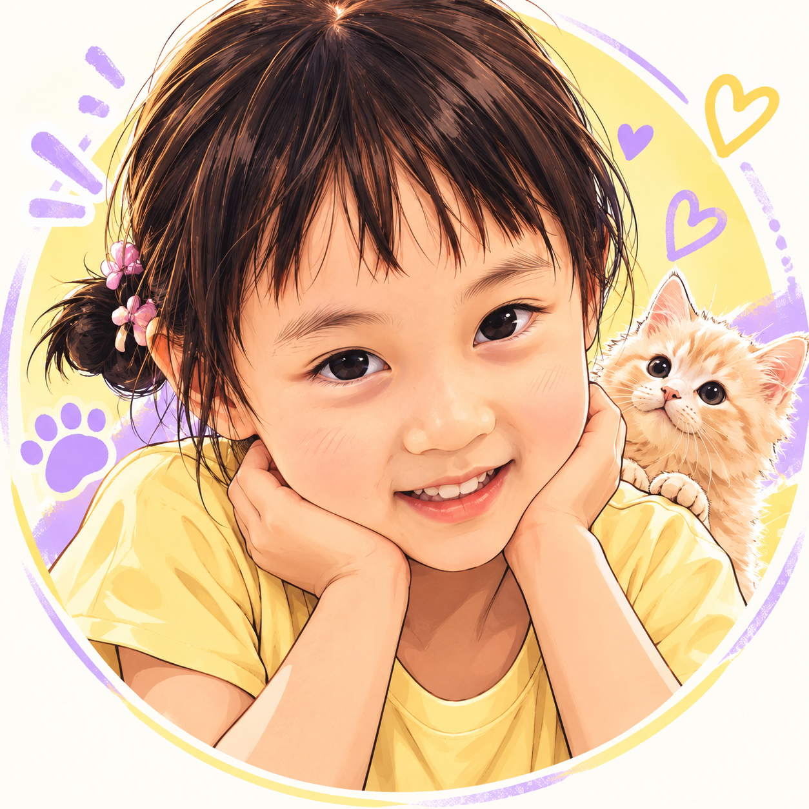

# jwan-alt-manga-avatar

Jwan photo-to-manga-avatar diptych Skill.

## Features

- Preserve the supplied portrait in the upper half of a vertical 9:16 image.
- Create a small centered manga avatar below with generous negative space.
- Keep identity, pose, expression, and clothing cues connected to the source.

## Case

## Usage

Use `$jwan-alt-manga-avatar` followed by one portrait photo. Optional instructions may specify color, expression, or signature.

## Repository structure

- `SKILL.md` — complete Skill definition
- `examples/` — generated case images
- `README.md` — usage and project notes
- `LICENSE` — MIT license for this Jwan adaptation

## Attribution

This is a Jwan-specific adaptation inspired by [Wibi Style alt-manga-avatar](https://github.com/Vieeeeeee/wibi-style/tree/main/skills/alt-manga-avatar). Review the source repository for its original attribution and license terms.

## License

Jwan-authored material in this repository is released under the MIT License. See `LICENSE`.
